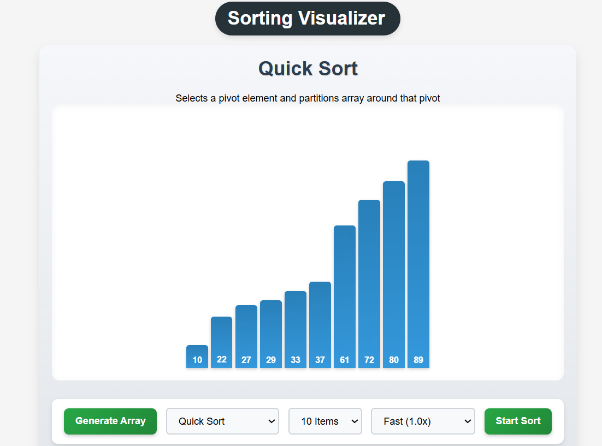
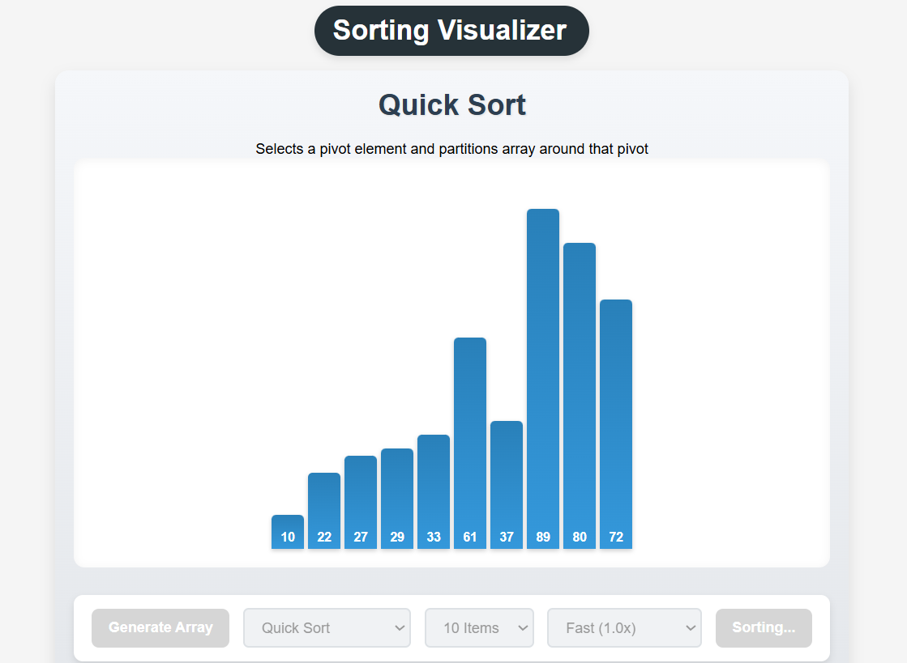

# Sorting Visualizer

A web application to visualize and understand various sorting algorithms. Easily generate arrays, select sorting algorithms, and watch the sorting process in real-time with beautiful animations.

## Features
- Visualize popular sorting algorithms (e.g., Quick Sort)
- Adjustable array size and sorting speed
- Interactive and educational UI

## Screenshots

### Initial State (Sorted Array)


### During Sorting (Quick Sort in Action)


## Getting Started
1. Clone the repository:
   ```bash
   git clone <repo-url>
   ```
2. Open `index.html` in your browser.

## Project Structure
- `index.html` - Main HTML file
- `css/style.css` - Stylesheet
- `scripts/` - JavaScript source files

## How to Use
1. Click **Generate Array** to create a new random array.
2. Select the sorting algorithm, number of items, and speed.
3. Click **Start Sort** to visualize the sorting process.

## License
MIT
